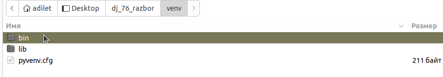

# Настройка конфигурации для дебаггера в VS Code

1. ## Убедитесь, что у Вас установлено расширение Python от Microsoft. 

Для этого, перейдите на вкладку `Расширения` и впишите в поле поиска <code>python</code>

## 2. Настройте интерпретатор для проекта. 

Чаще всего, он находится в виртуальном окружении.

- Откройте любой модуль с кодом и нажмите сочетание клавиш `Ctrl + Shift + P`
- в открывшемся окне впишите `Python: Select interpreter` и выберите его

- в следующем окне будут отображены возможные варианты интерпретаторов

- если среди них есть интерпретатор из виртуального окружения, то выбираем его
- если же он не представлен в списке, то выбираем пункт `Введите путь к интерпретатору`
- в открывшемся окне указываем путь до файла python или python3 из окружения проекта. Путь будет следующим:
`<название_окружения>/bin/python` или `<название_окружения/Scripts/python>` (в зависимости от Вашей ОС)

## 3. Убедитесь, что интерпретатор установлен

- откройте любой модуль
- в нижней панели Вы должны увидеть надпись следующего вида `версия_python: (название_окружения: venv)`

- также, при запуске встроенного терминала, должно автоматически активироваться виртуальное окружение

## 4. Добавьте конфигурацию для Django

- перейдите на вкладку `Запуск и отладка` и выберите пункт `создайте файл launch.json`

- в открывшемся окне, выберите `Python`, а затем `Django`

- в итоге, у Вас появится файл `launch.json` следующего вида:

- в данную конфигурацию внесите ещё один элемент `"python": "${command:python.interpreterPath}"`. 
Это укажет дебаггеру, какой интерпретатор выбрать для запуска

## 5. Выберите конфигурацию `Python: Django` во вкладке `Запуск и отладка`. 
Теперь Вы можете выставлять точки останова и дебажить проект