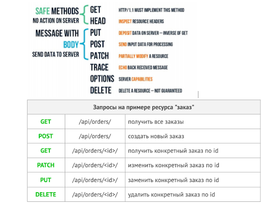

## lesson 5.5 Знакомство с API на примере Django REST framework

### Учебный материал:
- **Введение в занятие Знакомство с API на примере Django REST framework**
- **Как именуются ресурсы в REST API**

REST API — архитектурный стиль проектирования API.

Основные требования:

1. взаимодействие клиент-сервер;
2. запросы содержат в себе все необходимое состояние;
3. строгое именование ресурсов;
4. использование семантики HTTP-методов и определенных кодов возврата.

 
  *Стандарт* [RFC:9110 HTTP Semantics](https://datatracker.ietf.org/doc/html/rfc9110#name-methods)

- **Установка и настройка DRF**
  `pip install djangorestframework`

- **Компоненты DRF**

**Сериализация** представляет собой процесс преобразования состояния объекта в форму, пригодную для сохранения или передачи.

**Десериализация (deserialization)** — это процесс создания структуры данных из битовой последовательности путем перевода этой последовательности в объекты и их упорядочивания (структуризации).

- **Generic APIView классы**

В DRF реализованы основные классы для работы с данными, такие как ListAPIView, RetrieveAPIView и т.п. Подробнее про такие классы и их возможности можно почитать [на этом ресурсе](https://www.django-rest-framework.org/api-guide/generic-views/)

- **Презентация "Знакомство с API на примере Django REST framework"**
- **Презентация к видео "Работа с ORM"**
- **Тест** Внимание!!!!! [Готовясь к тесту читай это и верь только этому! GPT врет! :)](https://datatracker.ietf.org/doc/html/rfc9110#name-methods)

- **[Код к занятию (листинг)](../DJ_code/orm_advanced)**

### Дополнительные материалы:

- [Настройка конфигурации для дебаггера в VS Code](../lesson_5.1/debug_config)
- [Пример настроенного файла конфигурации для дебага проекта Django](.vscode)

### [Мой код по материалам занятий](../lesson_5.1/dj_proect/)

### [Домашняя работа](../dj-homeworks/2.2-databases-2/)
